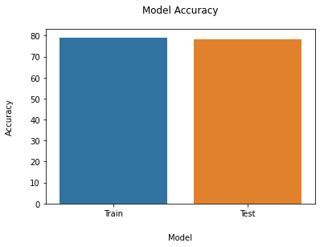
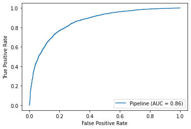
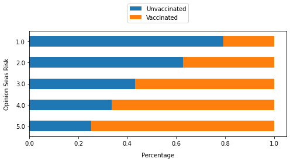
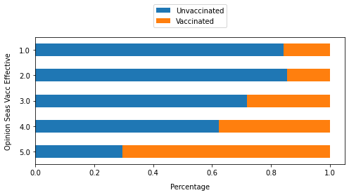
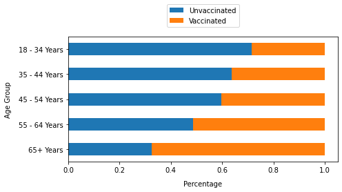
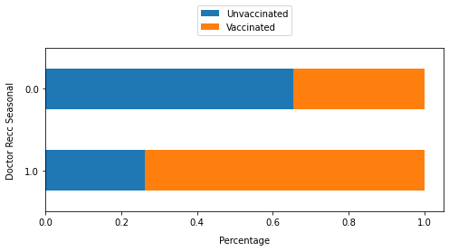

# Flu-Shot-Classifier
Predicting likelihood of individuals receiving seasonal flu vaccines 

Author: Meir Alelov

# A Frightening Exploration of Data Ethics

The purpose of this project is to shed light on the potentially detrimental misuse of power that comes with being a data scientist. It's very Spiderman-y when it comes to responsibility and what not. As data scientists, we have spent hours on end, burned innumerable electrons honing in and fine tuning a skill which, honestly, feels like a super power that we can use to sway decisions. Big decisions. People in lofty roles oftentimes lack the technical skills necessary to build, say, a convolutional neural network model. Instead, they enlist data scientists to provide them with the necessary information needed to make important decisions through a scientific lens. 

A data scientist can uncover hidden solutions for real life problems, which, unfortunately, in our capitalistic society, tend to gravitate toward business problems specifically. We are able to dive deep into the underbelly of data and uncover hidden treasures manifested both as cognizance and actionable insights for a broad range of domains. Such an incredible lens is not available to the masses. It's an expensive luxury that few can afford. 

As you read this, please keep in mind that it is for illustrative purposes only. My views absolutely do not align with the project I am pretending to undertake for an employer I would never work for. I am doing this to show that, in fact, this can be done, and does happen.

We are now playing make-believe. I will show how I've taken on a role as a data scientist for a prominent anti-vaxxer, who has hired me to provide him with actionable insight into lowering vaccination rates. Yikes. The following is a README which would be attached to the technical notebook.

Ok, here we go.

# Overview
Not only has there been significant debate surrounding vaccines, but, in the past few years, the debate seems to have heated up tremendously in a post-Covid world. Vaccination status has been a hot topic in American discourse. As such, many have taken their own stand on vaccines and misinformation spread is significantly high surrounding this topic.

This machine learning model solves a classification problem. It categorizes which class an individual falls under. In this case, the classes are either vaccinated or unvaccinated for the seasonal flu. On top of being able to accurately predict which category an individual belongs to, I will focus on the top categories which affect someone’s vaccination status the most, in order to offer specific recommendations.

# Business Understanding
Robert Kennedy Jr., an outspoken attorney with significant family ties, is one of the more influential figures in our country spearheading the anti-vaccine movement. The charities he runs yield around half a million dollars a year. According to the group’s latest tax filings, 2020 was a lucrative year. He earned around three hundred and fifty thousand dollars as chairman of Children's Health Defense. This group claims that vaccines are contributing to a multitude of childhood illnesses. He has yet to pocket an additional 3 million (at least) from his best-selling book, "The Real Anthony Fauci: Bill Gates, Big Pharma and the Global War on Democracy and Public Health.” 

Clearly, there is big money to be made here.

How does one monetize this social battleground? Like with any war, those in lofty positions make the most profit. If an individual demonstrates significant sway of public opinion, there is an increased likelihood of financial gain from a plethora of different sources. Said sources feel so strongly about vaccination status, that they are willing to dish out millions of dollars to those who are on the forefront, influencing the opinions of the masses. Centering oneself as an influential figure in the crux of a nationwide debate will yield monetary support in the form of donations, as well as securing leadership positions, which have proven to provide significant income streams. 

My goal is to provide actionable recommendations which could be deployed as tactics to influence the vaccination rates in this country. By doing so, one ascertains a tangible track record which shows the ability to change public opinion. Such power is expensive, and people will pay. 

# Data Understanding
The data comes from the National 2009 H1N1 Flu Survey (NHFS).

Between 2009 and 2010, the United States conducted the National 2009 H1N1 Flu Survey. This was a phone survey which asked individuals about their seasonal flu vaccination status, as well as additional questions regarding the individuals. These supplementary questions ranged from social and economic background, demographics, to opinions on risks of illness and vaccine effectiveness, and even behaviors to mitigate transmission. Understanding the relationship between these characteristics and vaccination status can shed light on actionable steps to make a difference, and impact the distribution of vaccinated vs. unvaccinated individuals.

As they referenced:

The National 2009 H1N1 Flu Survey (NHFS) was sponsored by the National Center for Immunization and Respiratory Diseases (NCIRD) and conducted jointly by NCIRD and the National Center for Health Statistics (NCHS), Centers for Disease Control and Prevention (CDC). The NHFS was a list-assisted random-digit-dialing telephone survey of households, designed to monitor influenza immunization coverage in the 2009-10 season.

The target population for the NHFS was all persons 6 months or older living in the United States at the time of the interview. Data from the NHFS were used to produce timely estimates of vaccination coverage rates for both the monovalent pH1N1 and trivalent seasonal influenza vaccines.

# Modeling

## Logistic Regression
As evident in some features, a response of 1 shows a higher rate of vaccinations, while a response of 0 shows a lower rate of vaccinations. There is somewhat of a linear relationship, but this is binary for the most part. A sigmoid function will help bent the line in a way that can better address this data. For that, we will use Logistic Regression as our first model.

CV Results for `log_pipe` model:
            0.77287 ± 0.00392 accuracy
        
 Train: 0.7738946934994081

These results are much better than the baseline model, right out the gate. Additionally, we can see that the train score is similar to the cv score, so the model is not overfit. The cv acts like a 'pseudo' test within the train data to isolate the actual testing data, thus preventing data leakage. Since this model is not overfit, but the score is not as high as I'd like, I can add more complexity and more features to get a better score. However, the risk of overfitting still stands if this is done. If I want to try to increase score without adding more complexity, I can tweak regularization. We will address this later with a GridSearch to maximize our hyperparameters. For now, this is a good starting point.

## Random Forest Classifier

Although decition trees were a dead end, it does not mean I am tossing out the underlying estimator altogether. Instead, I'm going to use an estimator which uses decision trees as its predetermined estimator, while at the same time adding two levels of randomization. Random forest classifier uses bagging (first level of randomization) and feature randomness (second level of randomization) when building each individual tree to try to create an uncorrelated forest of trees whose prediction by all of the trees is more accurate than that of any individual tree.

CV Results for `forest_pipe` model:
            0.75979 ± 0.00765 accuracy
        
 Train: 0.9918163569921252

Score is higher than decision trees. I'm on the right track. Adding more levels of randomization resulted in a higher accuracy score.

## Gradient Boosting Classifier

Gradient boosting classifier combines many weaker learning models together to create a strong predictive model. Decision trees are usually used when doing gradient boosting. I would like to see if boosting will result in better scores than random forest, since both use decision trees. Gradient boosting classifier minimizes a loss function by iteratively choosing a function that points towards the negative gradient.

CV Results for `boost_pipe` model:
            0.78007 ± 0.00596 accuracy
        
 Train: 0.7879973235884502
 
This is the best performing model yet. Accuracy score increased and overfitting decreased. This performed better than logistic regression and random forest.

Since this is my best performing model so far, I will put it aside and run a gridsearch on it later. Definitely worth exploring this futher. Although it's my best model, I'm not going to forget about lr or random forest, as doing a hyperparameter search for them could prove to be helpful. I haven't fine tuned anything yet, so I'm still considering lr and rfc.

## Stacking Classifier

Stacking classifier is another ensemble learning method where the predictions of multiple classifiers are used as new features to train a meta-classifier. This estimator stacks the output of individual estimators and use a classifier to compute the final prediction. Stacking allows to use the strength of each individual estimator by using their output as input of a final estimator.I like the meta iterative approach this estimator has to offer. Let's see how it performs with my top 3 performing estimators. I'm not going to use voting classifier within the stacking classifier because I don't want too much complexity. This will most likely result in a very overfit model. Instead, I'm going to use my top 3 non ensemble estimators.

CV Results for `stacked_pipe` model:
            0.78131 ± 0.00569 accuracy
        
 Train: 0.8014823202429359
 
This estimator is scores very slightly better than boost. So far this is the best estimator, although it's more overfit than boost, which is the second best estimator.

## Grid Search

Since a grid search is very computationaly expensive, I'm going to run a grid search on each individual model within the stack, and then apply those fine tuned hyperparameters, and then run a grid search on the following estimator with those prevoiusly calculated hyperparameters in place for the previous model. This is an iterative approach of grid searching within the stacking. The reason I'm able to do this is because it lines up nicely with the way the stacking classifier works, in the sense that it's using output from previous model to influence output of the following model. As I iterate through the grid searches, I am going to use those hyperparameters when grid searching the next estimator in the list within my stack. In this way, I am fine tuning as I grid search on the next model, to then fine tune it, and so on.

# Evaluation
Based on the business problem, I will be primarily focusing on accuracy score as my metric to assess the quality of each model. Since false classification will not result in any ethical concerns, I am only concerned with the accuracy of the model in how it predicts class. Unlike other medical business problems, the implication of a false negative is not as detrimental as, say, a diagnostic tool. On the flip side, it will not be too costly if there is a false positive. In a diagnostic medical context, a false positive would mean an individual has to undergo further testing and potentially unnecessary treatment, which will not only reflect poorly on the company running the test, but also end up being more costly. For this reason, recall, precision, F1 are not important for this business problem.

## Final Model

I have chosen to use stacking as my ensemble learning method, with my top 3 basic models within it. This performed better than voting classifier. After running a grid search on each estimator within my stack, I have iterated to find the best performing model with the best parameters.

We can see that the model is not significantly overfit when comapring train score to cv score for our 'pseudo' test. This is a good sign.

CV Results for `final_pipe` model:
            0.78043 ± 0.00578 accuracy
        
 Train: 0.7959236193319265
 Test: 0.7841593330245484

More importantly, the model performs similarly on train and test data, so it is not overfit.

This final model predicts vaccination status with 78.4% accuracy.

The ROCAUC curve is a performance metric used for classification problems at varying thresholds. The AUC, or area under the curve, represents the measure of separability. In other words, it describes how well the model does at distinguishing between the two classes of the target. The higher the AUC, the better the model is at predicting true positives and true negatives. As it applies to this business understanding, the higher the AUC, the better the model is at predicting whether individuals got the vaccine or not.

86% of the people that are predicted to be vaccinated were in fact vaccinated. This is the true positive. 86% success rate for positive predictions.

## Feature Importances and Coefficients

### Target Distributions of Most Important Features and Coefficients

As evident, there are 3 features/coefficients that are ranked highest for all 3 columns. They are opinion_seas_risk, opinion_seas_vacc_effective, and doctor_recc_seasonal. Additionally, x0_65+ Years appears in two of the three sorted dataframes, so I will include this as well.

The top features/coefficients are x0_65+ Years, opinion_seas_risk, opinion_seas_vacc_effective, and doctor_recc_seasonal.

The coefficient of logistic regression shows the expected change in log odds of having the outcome per unit change in X. So increasing the predictor by 1 unit multiplies the odds of having the outcome by e^β.

For random forest, we can measure how each feature decrease the impurity of the split. The feature with highest decrease is selected for internal node. We can ascertain how any given column, on average, decreases the impurity. The average over all trees in the forest is the measure of the feature importance.

In gradient boost, feature importance is a score which indicates how useful each feature was in creation of the boosted decision trees within the model. The more a specific feature was used to make important decisions with decision trees within the boost model, the higher that feature's relative importance is.

## Recommendations
- Targeting individuals 65 years and older to try and reduce their vaccination rates.
- Addressing opinions of the masses about the risk of getting infected without a vaccine.
- Addressing opinions of the masses about the effectiveness of the vaccine.
- Targeting doctors to offer incentives for withholding vaccination recommendation.

# Conclusion
The factors which mostly affected whether someone is classified as vaccinated or not are individuals 65 years and older, opinion about risk of getting infected without a vaccine, opinion about the effectiveness of the vaccine, and a doctor's recommendation on receiving the vaccine. These features, or responses in the survey, had the highest weight in determining the class an individual belongs to. Therefore, we should focus on these features specifically.

Based on the top features and coefficients, we now know which factors most strongly affect the vaccination rate of any given individual. Therefore, honing in on these features and addressing them directly will result in the most change to vaccination rates. The above actionable recommendations will result in a significant sway of public opinion and a reduction of vaccination rates.

You have hired me to provide you with the necessary tools to reduce vaccination rates, thus allowing you to further influence the masses so that you may be an even more influential figure in this ongoing debate. You will be able to leverage your proven track record. By wielding such power, people will pay you to represent their views and provide funding. An increased credibility and recognition of your actions will also result in more book sales.

## Phewf. 

Ok, enough pretend time. One can only keep a straight "blog face" for so long. Wasn't that cringey? I literally shuttered as I wrote out my recommendations. The fact that there are actually people out there who use their data science powers to supplement questionable decisions is horrifying. The scariest part about this, in my opinion, is that my analysis and interpretation of the data is unbiased until the recommendations section. I simply determined which coefficients most strongly affect vaccination rates. Those working for the dark side use the same techniques and gain the same insights from the data. It is how they frame these insights, however, which determines their use, and whether they prey on elderly citizens or not. 

Not unlike a defense attorney representing a repeat offender, such are the data scientists who sell out and misuse their powers to aid individuals who do not have humanity's best interest in mind. They have decided that money trumps ethical responsibility. It is up to us to hold each other to high moral standards when wading through the waters of data. There are people out there who will pay significant sums to enlist our super powers. We must choose a path which aligns with the betterment of humanity, as opposed to its exploitation.
